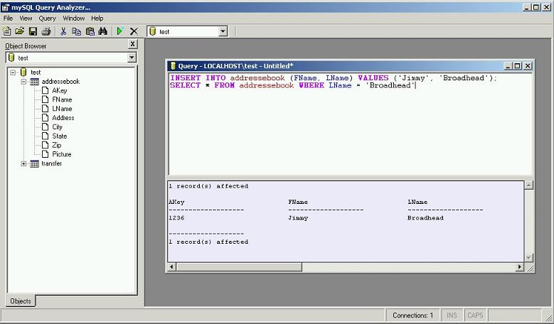



## mySQL Query Analyzer

### Description

myAnalyzer is a simple query analyzer that allows users to run SQL Statements to their mySQL database. This program does not use ADO but rather connects directly to mySQL through the DLL file included with mySQL (this through the help of some code borrowed from an individual mentioned inside the code). myAnalyzer also allows the user to save the sql query as well as print the query or it's results. The program has full search capabilities and can run multiple queries in one window or multiple queries through several databases in an MDI environment. I hope this benefits others out there as I wrote it to help me debug my SQL queries for my apps. You can connect to your mySQL server through a logon screen, or pass the information through to the exe from another application or command line.
 
### More Info
 
myAnalyzer.exe hostname, username, password

You MUST have mySQL server installed and have the libmySQL.dll available for DLL calls.

             |
---                |---
**Submitted On**   |2004-06-04 10:11:16
**By**             |[Jimmy C\. Broadhead, Jr\.](https://github.com/Planet-Source-Code/PSCIndex/blob/master/ByAuthor/jimmy-c-broadhead-jr.md)
**Level**          |Advanced
**User Rating**    |5.0 (75 globes from 15 users)
**Compatibility**  |VB 6\.0
**Category**       |[Databases/ Data Access/ DAO/ ADO](https://github.com/Planet-Source-Code/PSCIndex/blob/master/ByCategory/databases-data-access-dao-ado__1-6.md)
**World**          |[Visual Basic](https://github.com/Planet-Source-Code/PSCIndex/blob/master/ByWorld/visual-basic.md)
**Archive File**   |[mySQL\_Quer175366642004\.zip](https://github.com/Planet-Source-Code/jimmy-c-broadhead-jr-mysql-query-analyzer__1-54176/archive/master.zip)

### API Declarations

See Code

